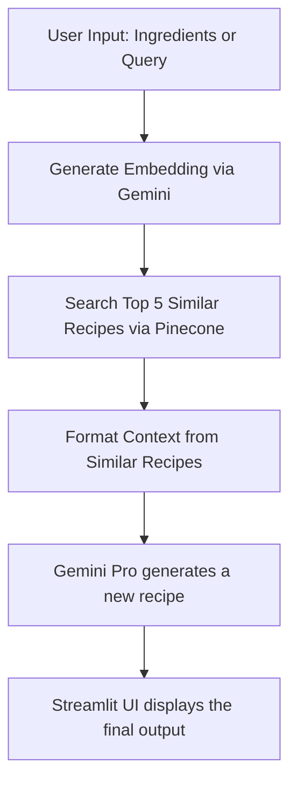

# 🇮🇳 AI Recipe Generator 🍛  
A Retrieval-Augmented Generation (RAG) system for generating personalized Indian recipes using [Google Gemini](https://ai.google.com/) and [Pinecone Vector DB](https://www.pinecone.io/), powered by a dataset of over 6,800 Indian recipes. Built with Streamlit for interactive UI.

---

## 🔥 Features

- RAG system: Semantic search + generative AI
- Embeds 6,800+ recipes using Google Gemini embeddings
- Uses Pinecone to retrieve semantically relevant recipes
- Gemini generates a personalized recipe based on input + context
- Fully interactive Streamlit frontend

---

## 📊 Dataset Overview

**Total Recipes:** 6,871  
**Columns:** 17 fields  
**Key Fields:**
- `TranslatedRecipeName`, `TranslatedIngredients`, `TranslatedInstructions`
- `PrepTimeInMins`, `CookTimeInMins`, `Cuisine`, `Course`, `Diet`
- `ComplexityLevel` (Easy/Medium/Hard)
- `MainIngredient` (Core component like Chicken, Dal, etc.)

---

## 🔁 Data Flow / Architecture



---

## 🧠 How It Works

1. **User enters** an ingredient or dish idea.
2. **Gemini Embedding API** converts the input to a vector.
3. **Pinecone** retrieves top-k similar recipes from the recipe database.
4. **Gemini Pro** is prompted with the input + recipe context to generate a new, creative recipe.
5. **Streamlit** displays the new AI-generated recipe in a readable format.

---

## 🛠️ Setup Instructions

### 1. Clone the Repo
```bash
git clone https://github.com/your-username/RAG-Food-Recipe-Generator.git
cd RAG-Food-Recipe-Generator
```

### 2. Install Requirements
```bash
pip install -r requirements.txt
```

If missing, create `requirements.txt` with:
```text
streamlit
pandas
pinecone
google-generativeai
tqdm
```

### 3. Add Your API Keys
Create a `config.py` file in the root directory:
```python
# config.py
PINECONE_API_KEY = "your-pinecone-api-key"
PINECONE_INDEX = "your-pinecone-index-name"
GEMINI_API_KEY = "your-gemini-api-key"
```

Also place your dataset file as:
```
indian_food_recipes.csv
```

### 4. Run the App
```bash
streamlit run app.py
```

---

## 📌 Notes

- First time using it? Click **"Index Recipes to Pinecone"** once to embed and store vectors.
- Protect your `config.py` by adding it to `.gitignore`.

---

## 🧪 Use Cases

- Smart cooking assistants
- Personalized recipe recommendations
- Indian cuisine NLP research
- Diet-specific or time-efficient cooking suggestions

---

## 📃 License

MIT License © 2025 Anurag Karpe
